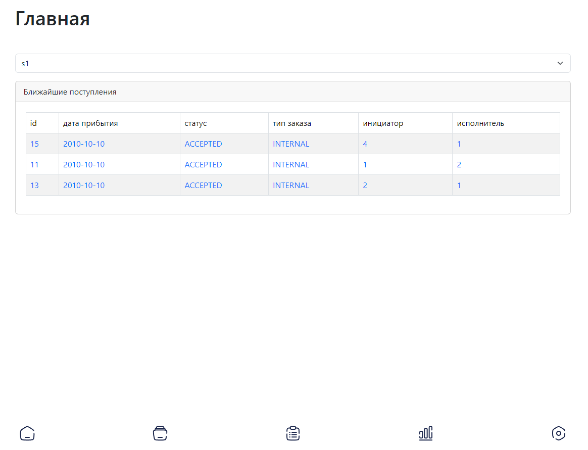

# Warehouse documentation

This documentation provides descriptive information on using this product for managing warehouses, with sales and supply requests.

On the main page there is a list of available warehouses and upcoming orders.

<figure><figcaption>
Main page
</figcaption></figure>

At the bottom of all pages there is an icon-navbar with links to : home, warehouse management, orders, statistics and profile and user management
