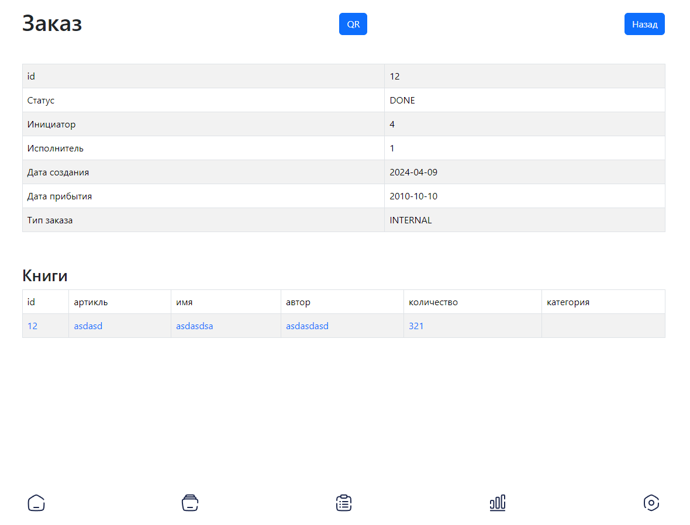
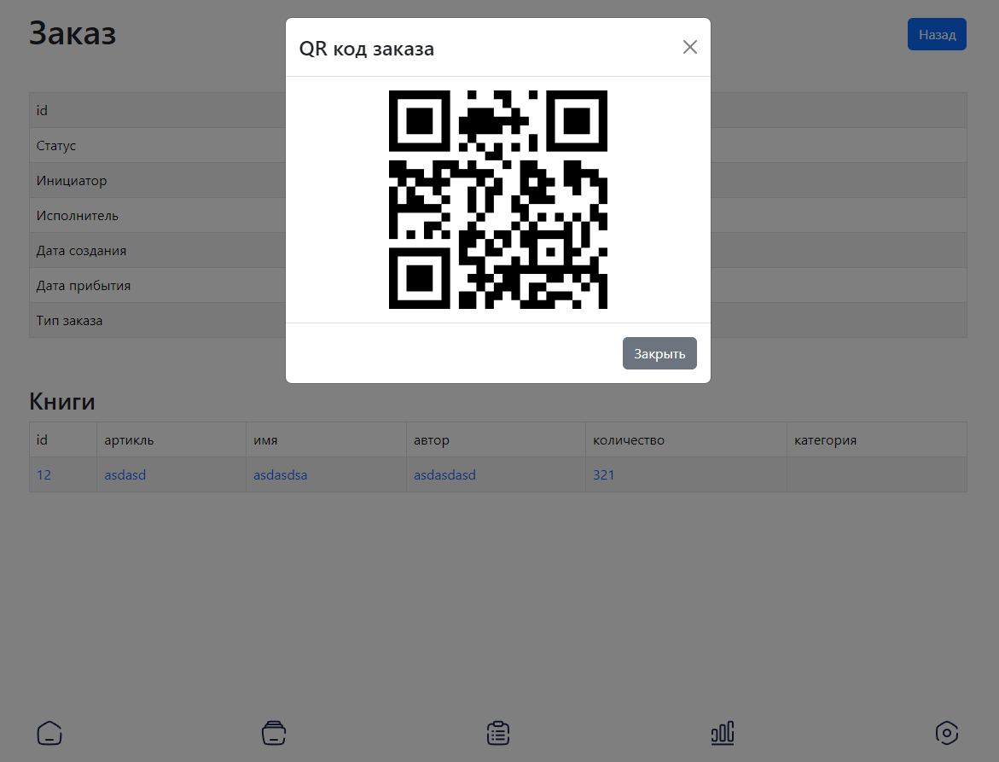
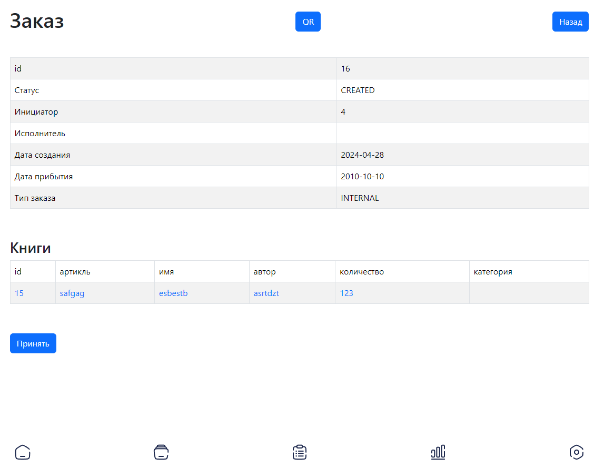
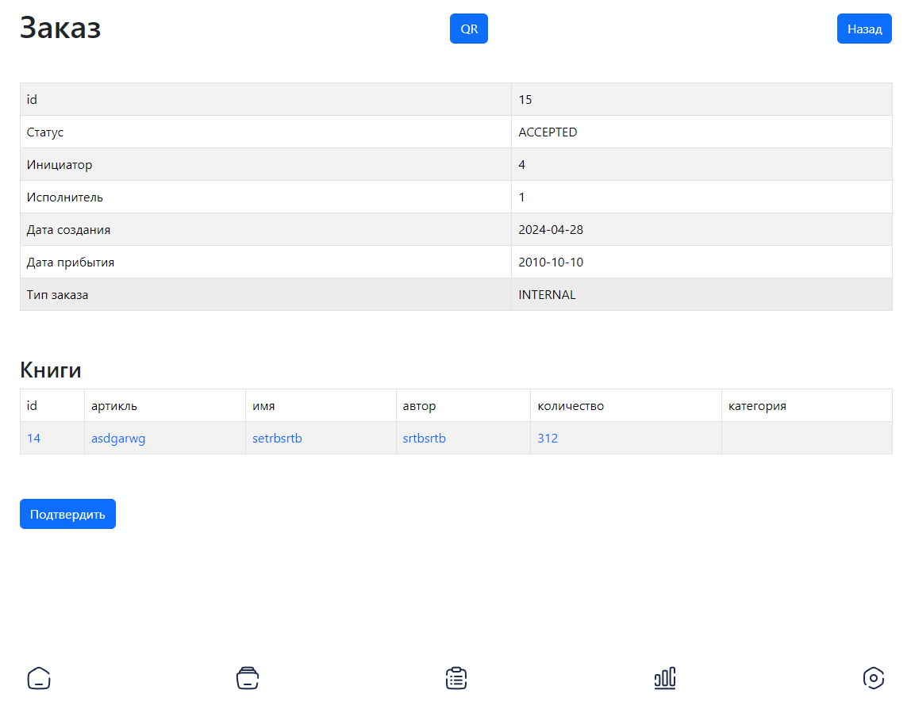

# Order

<figure><figcaption>Order page</figcaption></figure>

On this page you can see info about order and also open the qr code which lead to this order.

<figure><figcaption>QR code to order</figcaption></figure>

If you are on the page of created order from another warehouse you can accept it.
<figure><figcaption>QR code to order</figcaption></figure>

If you are on the page of order which is travel to current warehouse you can confirm it.
<figure><figcaption>QR code to order</figcaption></figure>

