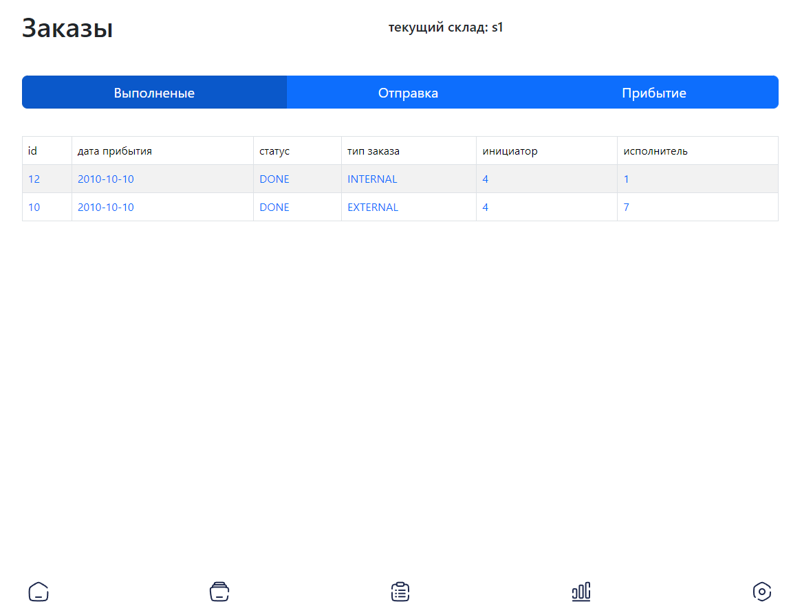

# Orders

<figure><figcaption></figcaption></figure>

On this page there is a table of all orders that have been accepted or completed. In this table main information of request is displayed alongside with id of employee, who is responsibility for this request.
